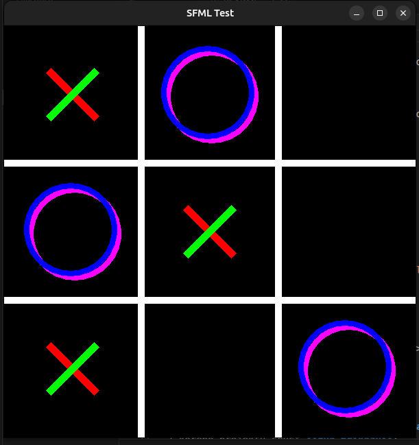
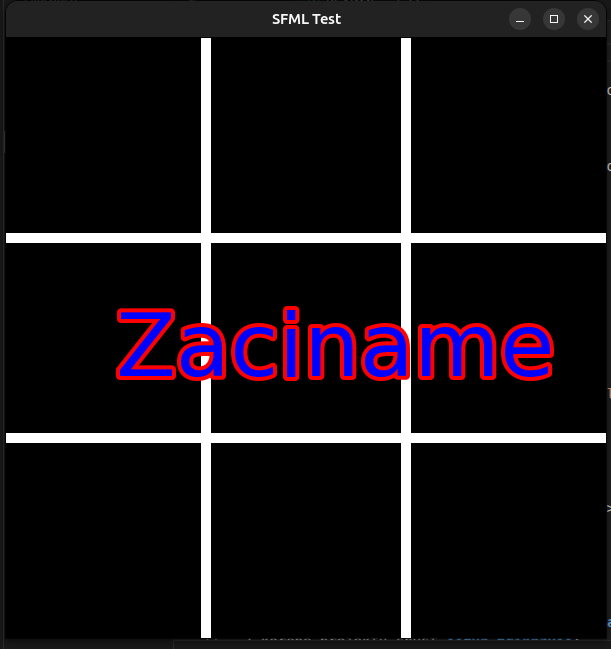
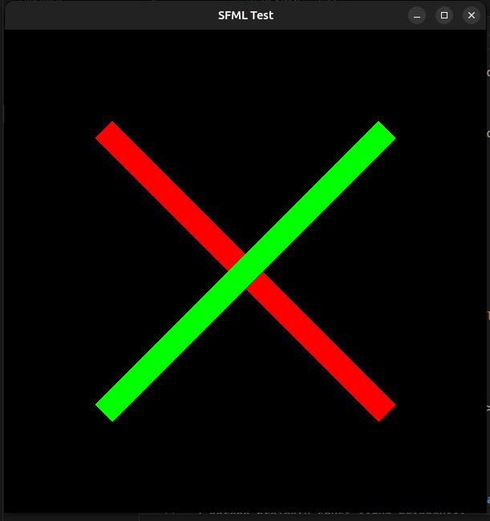

# SFML Test (C++)

Jednoduchý projekt v C++ s **SFML** (2D okno, mřížka, kreslení tvarů a textu). Vhodné jako základ pro piškvorky / tic‑tac‑toe a další malé hry.

## 🚀 Funkce
- Vytvoření okna (`sf::RenderWindow`)
- Vykreslení mřížky a herních prvků (kolečko/křížek)
- Základ klikací logiky
- Ukázky práce s barvami a tloušťkou čar

## 🧰 Požadavky
- Ubuntu / Linux (funguje i jinde)
- `g++`, `make`
- Knihovna **SFML** (grafika, okno, systém)

Instalace na Ubuntu:
```bash
sudo apt update
sudo apt install g++ build-essential libsfml-dev
```

## 📦 Stažení projektu
Pokud chceš projekt stáhnout/clonovat:
```bash
git clone https://github.com/<tvuj-username>/<nazev-repozitare>.git
cd <nazev-repozitare>
```

> Alternativně stáhni ZIP z GitHubu (Code → Download ZIP) a rozbal.

## 🛠️ Kompilace a spuštění (jednoduchá varianta)
Z kořene projektu spusť **dva příkazy**:

```bash
g++ main.cpp -o hra -lsfml-graphics -lsfml-window -lsfml-system
./hra
```

## 🗂️ Struktura projektu (doporučení)
```
.
├── assets/
│   └── fonts/
│       └── DejaVuSans.ttf     # doporučený font (zkopíruj sem)
├── main.cpp
└── README.md
```

## ▶️ Spuštění
Po úspěšné kompilaci stačí:
```bash
./hra
```
## Ukázka







